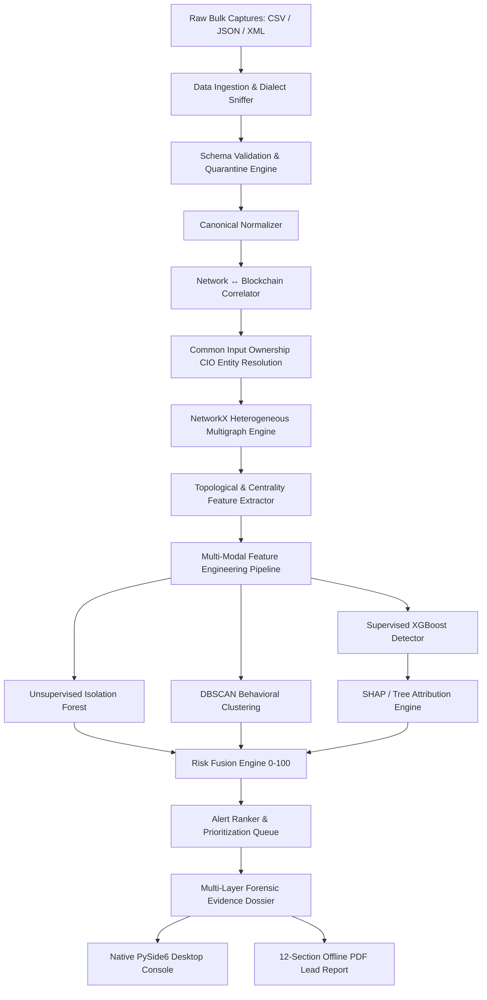

# TRACE System Architecture

**SIH26146 — AI-Powered Monitoring & Analysis of Bitcoin Transaction Traffic**  
**Organization:** National Technical Research Organisation (NTRO)  
**Theme:** Blockchain & Cybersecurity  

---

## 1. Architectural Philosophy: 100% Offline Forensic Intelligence

TRACE is engineered as a zero-trust, air-gapped forensic desktop workstation for law enforcement and intelligence analysts. It purposefully **does not** integrate with live mainnet nodes, mempool APIs, cloud LLMs, or remote services. Instead, it ingests bulk forensic captures (CSV, JSON, XML) and synthesizes multi-layer evidence through a 14-stage analytical pipeline.

---

## 2. Pipeline Subsystems

### Subsystem 1: Ingestion & Validation
- **Multi-Format Parsers:** Auto-detects delimiters (`,`, `;`, `\t`, `|`), JSON lists, JSON Lines (JSONL), and XML structures.
- **Validation Rules:** Cryptographic verification of 64-character hexadecimal TXIDs, IPv4/IPv6 syntax, TCP port ranges, and Bitcoin address heuristic checks.
- **Data Quality Assurance:** Categorizes records into `VALID`, `INVALID`, `QUARANTINED`, and `DUPLICATE` without silent data loss.

### Subsystem 2: Cross-Layer Correlation
- **Direct Hash Linkage:** Cryptographic correlation using transaction hash (`txid`) between network P2P broadcast frames and on-chain ledger records.
- **Evidentiary Caveat Enforcement:** Maintains the critical distinction that observed relay IPs represent broadcast hops rather than verified wallet ownership.

### Subsystem 3: Entity Resolution & Common Input Ownership (CIO)
- **Disjoint Set Union (Union-Find):** Clusters co-spent input addresses into heuristic entities with path compression and rank-based unions.
- **Confidence Calibration:** Computes heuristic certainty metrics with clear statutory disclaimers.

### Subsystem 4: Graph Analytics (NetworkX)
- **Heterogeneous Graph Schema:** Nodes (`IP`, `Wallet`, `Transaction`, `Entity`, `Cluster`) and typed directed edges (`OBSERVED`, `INPUT`, `OUTPUT`, `COMMON_INPUT`, `MEMBER_OF`).
- **Graph Centrality:** Computes in/out degrees, PageRank, betweenness centrality, clustering coefficients, and multi-hop shortest evidence paths.

### Subsystem 5: Multi-Modal AI/ML Engine
- **Supervised Classifier (XGBoost):** Classifies complex behavioral profiles against known anomaly patterns without ground-truth leakage.
- **Unsupervised Anomaly Detector (Isolation Forest):** Measures multivariate deviation from baseline population distributions.
- **Behavioral Clustering (DBSCAN + PCA):** Discovers cohorts of entities exhibiting similar flow and velocity signatures.
- **Forensic Explainability (SHAP):** Calculates exact feature attributions explaining *why* an entity was flagged.

### Subsystem 6: Risk Fusion & Lead Generation
- **Weighted Multi-Signal Synthesis:** Combines supervised model probability, anomaly score, graph topological indicators, and network dispersion into an internal 0–100 priority score.
- **Evidentiary Confidence:** Separates risk severity from evidentiary confidence and qualitative strength (`HIGH`, `MODERATE`, `LOW`).

### Subsystem 7: PySide6 Desktop Workstation
- Native Qt Widgets GUI built on `QMainWindow` and `QStackedWidget`.
- Background worker execution via `QThread` ensuring the interface never freezes during intensive computation.
- Interactive `QGraphicsView` link analysis canvas with zoom, pan, 1-hop/2-hop neighborhood expansion, and evidence chain tracing.
